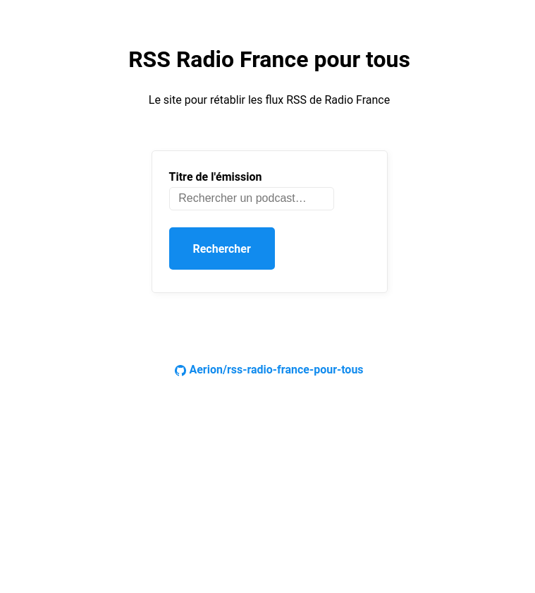
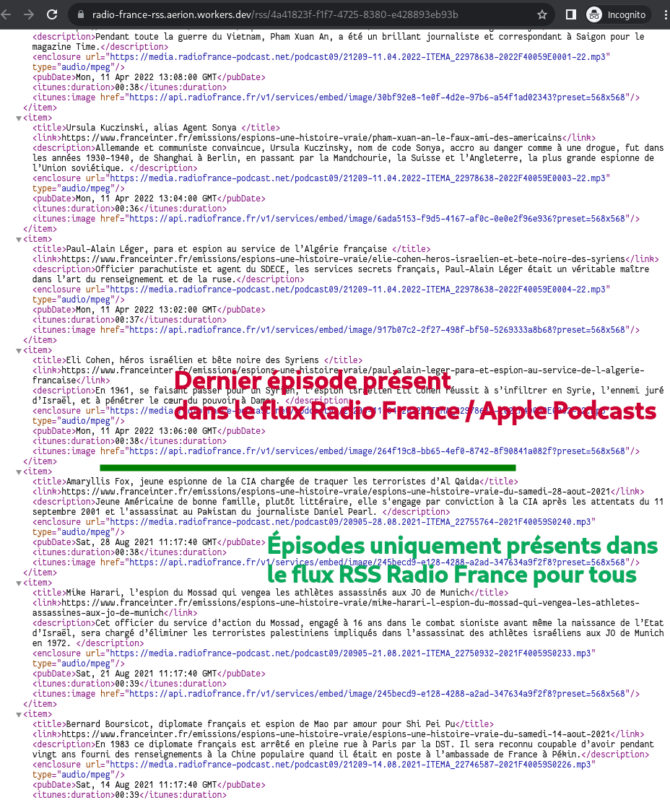
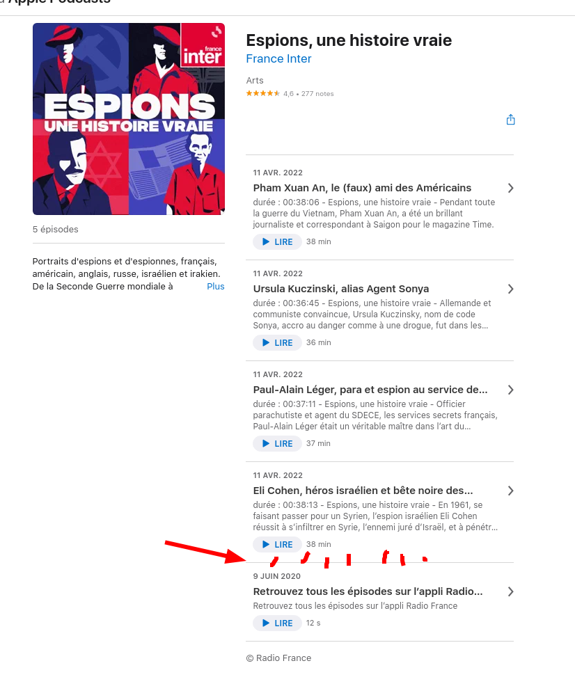

# RSS Radio France pour tous

Le [site](https://radio-france-rss.aerion.workers.dev/) pour rétablir les flux RSS de Radio France.

## Contexte

Les podcasts de Radio France sont accessibles depuis l'interface web ou l'application Radio France.

Cependant, les flux RSS (et Apple Podcasts) ne contiennent qu'un sous-ensemble des épisodes disponibles (les 5 derniers + ceux du mois précédent).

## Solution

Le site [https://radio-france-rss.aerion.workers.dev/](https://radio-france-rss.aerion.workers.dev/) propose une interface de recherche des émissions des podcasts de Radio France et un lien permettant d'obtenir un flux RSS contenant tous les épisodes.

Ce flux RSS peut ensuite être ajouté à votre application de podcasts (e.g. [AntennaPod](https://antennapod.org/)) et enlever la dépendance à l'application Radio France.

Techniquement, un script Cloudflare Worker est invoqué pour utiliser les mêmes APIs que l'application Radio France.

### Demo

Pour un podcast sélectionné (_Espions, une histoire vraie_), on peut voir :

- La page d'accueil de _RSS Radio France pour tous_
- Les résultats de la recherche
- Le contenu du flux RSS de _RSS Radio France pour tous_
- Le contenu du flux Apple Podcasts (même contenu que le flux RSS de Radio France)

